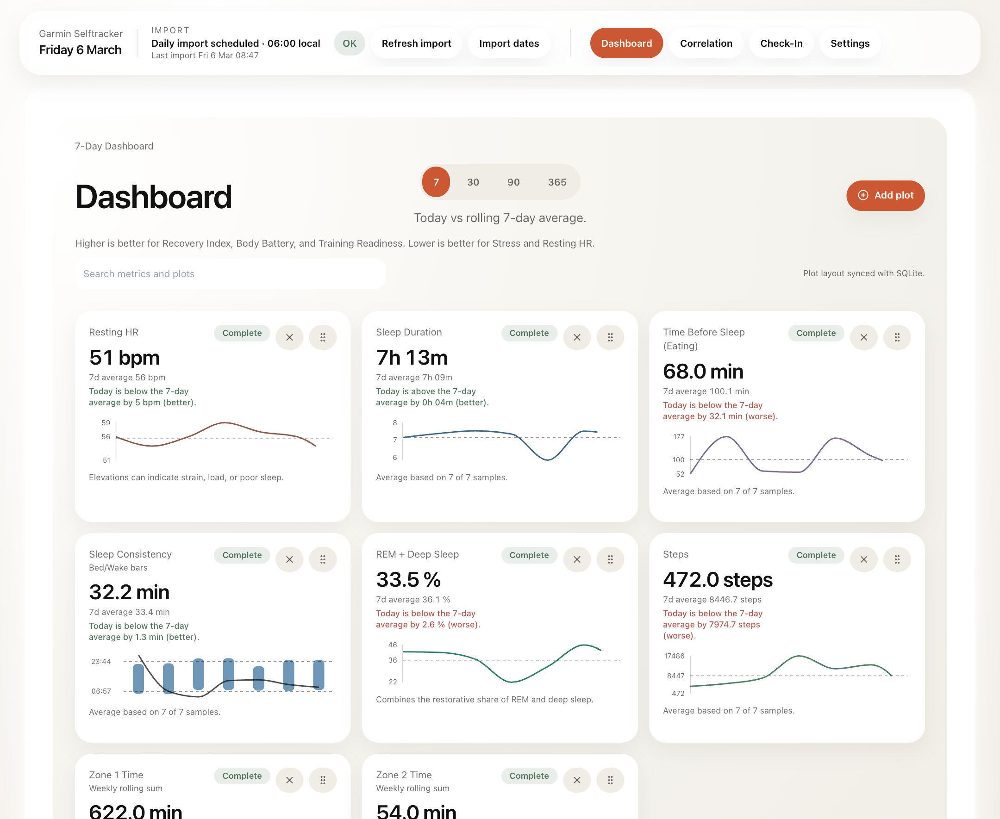
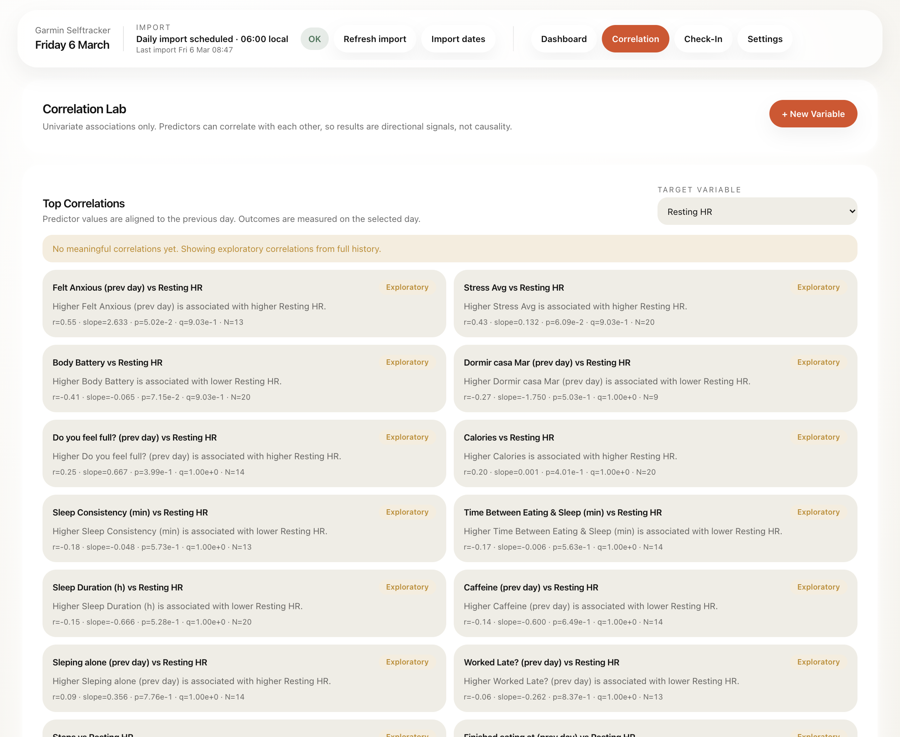
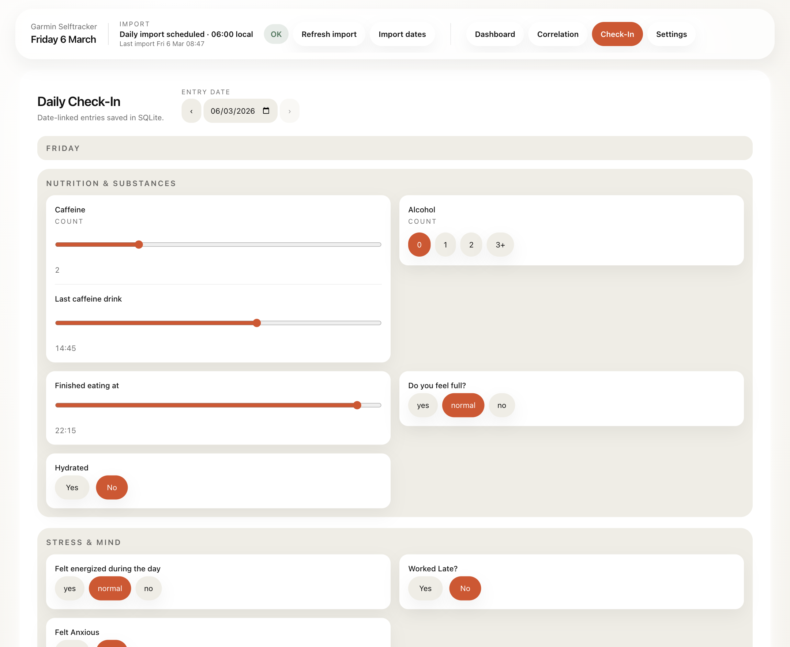
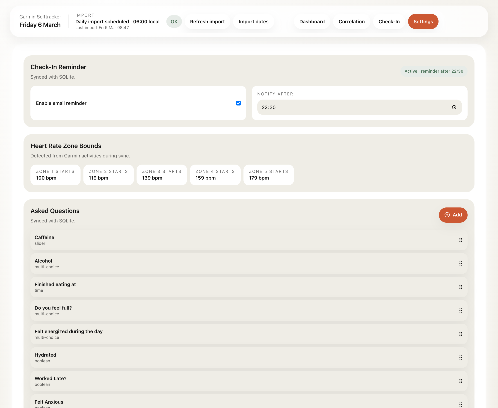
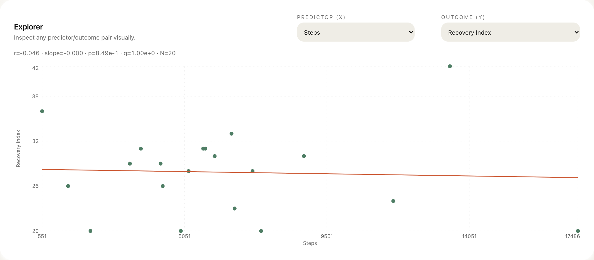

# garmin-selftracker

`garmin-selftracker` is a local-first personal analytics workspace for people who want more than the Garmin Connect app gives them out of the box. It pulls Garmin data into a local SQLite database, combines it with manual daily check-ins, and exposes everything through a dashboard built for reviewing trends, comparing habits against recovery signals, and exploring simple correlations over time.


<table>
  <tr>
    <td width="50%">
      
    </td>
    <td width="50%">
      
    </td>
  </tr>
  <tr>
    <td valign="top">
      <strong>Dashboard</strong><br />
      Review current status, rolling averages, and dashboard plots pulled from your local Garmin data.
    </td>
    <td valign="top">
      <strong>Correlation Lab</strong><br />
      Review ranked associations between Garmin signals and your own check-in variables.
    </td>
  </tr>
  <tr>
    <td width="50%">
      
    </td>
    <td width="50%">
      
    </td>
  </tr>
  <tr>
    <td valign="top">
      <strong>Daily Check-In</strong><br />
      Capture contextual habits and subjective signals that Garmin does not track on its own.
    </td>
    <td valign="top">
      <strong>Settings</strong><br />
      Manage reminders, detected heart rate zones, and the question set used in your daily check-ins.
    </td>
  </tr>
</table>

<p align="center">
  
</p>
<p align="center">
  <strong>Correlation Explorer</strong><br />
  Drill into a specific predictor/outcome pair and inspect the underlying scatterplot directly.
</p>

## Run with Docker

1. Create env file:

```bash
cp .env.example .env
```

2. Set Garmin credentials in `.env` and email configuration if you want an email reminder:

```bash
GARMIN_EMAIL=you@example.com
GARMIN_PASSWORD=your_password
# Email
SMTP_HOST=smtp.gmail.com
SMTP_PORT=587
SMTP_USER=example@gmail.com
SMTP_PASS=<insert_pass>
```

3. Start services:

```bash
docker compose up --build
```

4. Open dashboard:

- [http://localhost:5180](http://localhost:5180)
