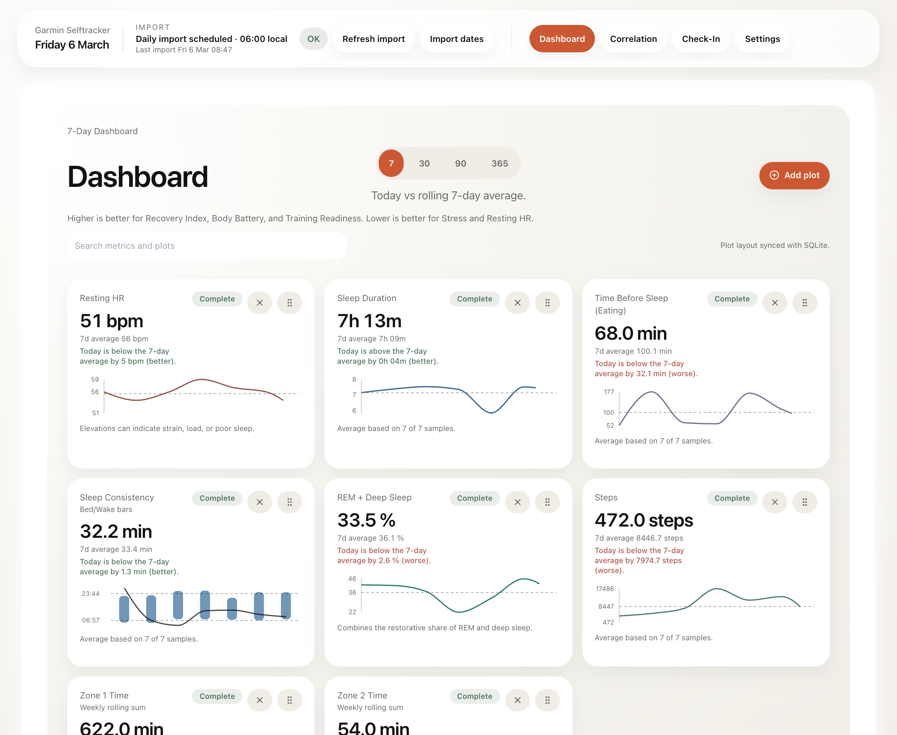
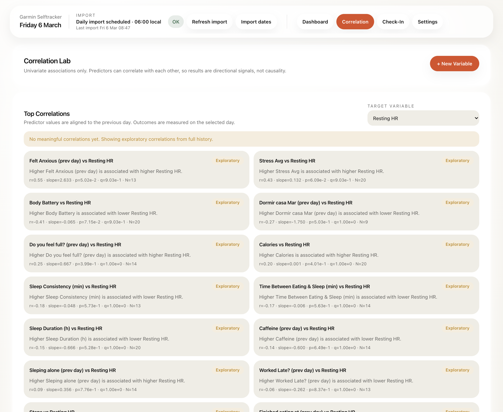
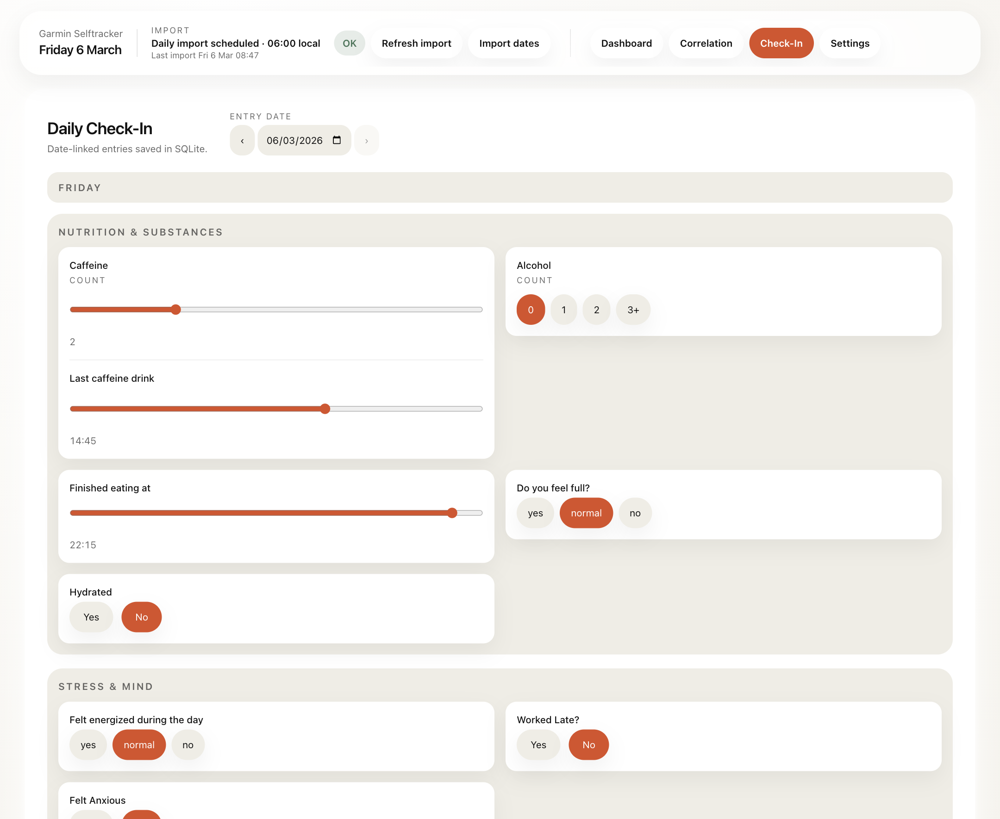
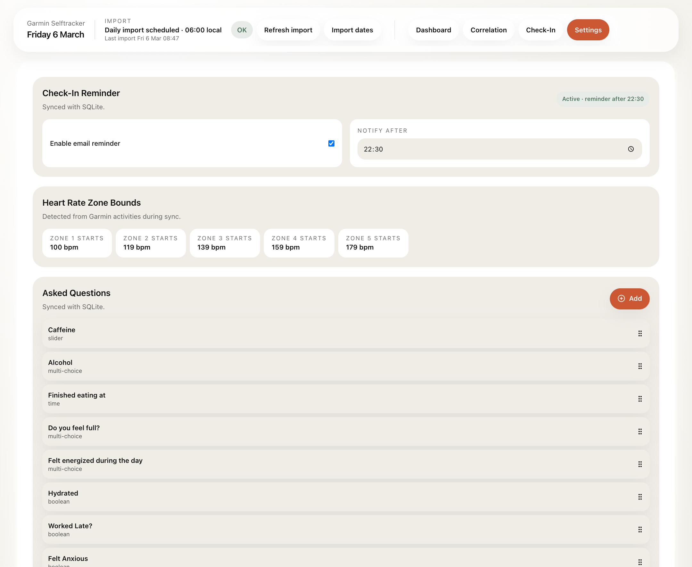
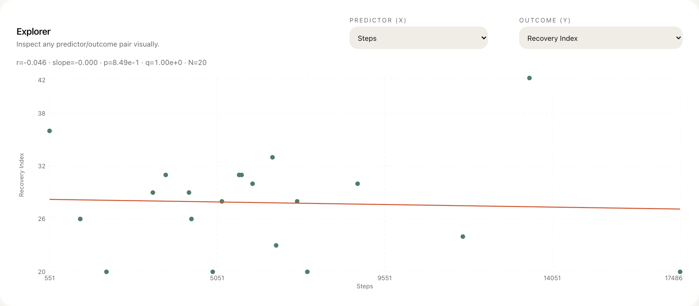

# garmin-selftracker

`garmin-selftracker` is a local-first personal analytics workspace for people who want more than the Garmin Connect app gives them out of the box. It pulls Garmin data into a local SQLite database, combines it with manual daily check-ins, and exposes everything through a dashboard built for reviewing trends, comparing habits against recovery signals, and exploring simple correlations over time.


<table>
  <tr>
    <td width="50%">
      
    </td>
    <td width="50%">
      
    </td>
  </tr>
  <tr>
    <td valign="top">
      <strong>Dashboard</strong><br />
      Review current status, rolling averages, and dashboard plots pulled from your local Garmin data.
    </td>
    <td valign="top">
      <strong>Correlation Lab</strong><br />
      Review ranked associations between Garmin signals and your own check-in variables.
    </td>
  </tr>
  <tr>
    <td width="50%">
      
    </td>
    <td width="50%">
      
    </td>
  </tr>
  <tr>
    <td valign="top">
      <strong>Daily Check-In</strong><br />
      Capture contextual habits and subjective signals that Garmin does not track on its own.
    </td>
    <td valign="top">
      <strong>Settings</strong><br />
      Manage reminders, detected heart rate zones, and the question set used in your daily check-ins.
    </td>
  </tr>
</table>

<p align="center">
  
</p>
<p align="center">
  <strong>Correlation Explorer</strong><br />
  Drill into a specific predictor/outcome pair and inspect the underlying scatterplot directly.
</p>

## Run with Docker

1. Create env file:

```bash
cp .env.example .env
```

2. Set Garmin credentials in `.env`.

If you want to install the dashboard on a phone or have reminder emails open it, serve it over HTTPS, set `DASHBOARD_URL` to that address, and add its hostname to `ALLOWED_HOSTS`. A private Tailscale HTTPS address works:

```bash
GARMIN_EMAIL=you@example.com
GARMIN_PASSWORD=your_password
GARMIN_TOKENSTORE=/data/garmin-tokens
GARMIN_MANUAL_IMPORT_DIR=/data/manual-imports
DASHBOARD_URL=https://<your-tailscale-hostname>.ts.net
ALLOWED_HOSTS=<your-tailscale-hostname>.ts.net,localhost,127.0.0.1

# Web Push identity (generate once with `npx web-push generate-vapid-keys --json`)
WEB_PUSH_VAPID_PUBLIC_KEY=<generated-public-key>
WEB_PUSH_VAPID_PRIVATE_KEY=<generated-private-key>
WEB_PUSH_VAPID_SUBJECT=mailto:you@example.com

# Email
SMTP_HOST=smtp.gmail.com
SMTP_PORT=587
SMTP_USER=example@gmail.com
SMTP_PASS=<insert_pass>
```

If you only use the dashboard from the same computer, `DASHBOARD_URL=http://localhost:5180` is still fine. Keep the VAPID private key secret and stable: replacing the pair requires each device to create a new push subscription.

`GARMIN_TOKENSTORE` defaults to `/data/garmin-tokens`. After the first successful Garmin login, the app reuses saved OAuth tokens from that directory to avoid repeated full sign-ins.

For Garmin web exports, place daily wellness `.zip` files in `data/manual-imports/`
on the host. The dashboard's `Import files` button reads that folder through
`GARMIN_MANUAL_IMPORT_DIR` and imports compatible `.fit` data without signing in
to Garmin.

3. Start services:

```bash
docker compose up --build
```

4. Open dashboard:

- [http://localhost:5180](http://localhost:5180)
- `http://<your-computer-ip-or-hostname>:5180` from your phone on the same network or VPN

## Install on iPhone

The dashboard includes a web app manifest, Home Screen icons, and a service worker. To install it:

1. Open its HTTPS address in Safari on the iPhone.
2. Tap **Share**, then **Add to Home Screen**.
3. Launch Selftracker from its new Home Screen icon.
4. Open **Settings → Push Notifications** and tap **Enable push notifications**.
5. Tap **Allow** in the iOS notification prompt.

If Selftracker was already installed before PWA support was added, remove that Home Screen copy and add it again so iOS picks up the manifest and icon. The service worker caches the application shell for resilient startup, but Garmin data and mutations still require access to the API.

The API provides the Web Push subscription lifecycle through `GET /api/push/public-key`, `POST /api/push/subscriptions`, and `DELETE /api/push/subscriptions`. Subscription endpoints and encryption keys are stored in SQLite and are never returned by the API.

## Development checks

Install the development tools and Git hook once after cloning:

```bash
python3 -m venv .venv
.venv/bin/python -m pip install --editable ".[dev]"
.venv/bin/pre-commit install
```

Every commit then runs Ruff formatting, Ruff linting, and the Python test suite.
The commit is cancelled if any check fails. Run the same checks on demand with:

```bash
.venv/bin/pre-commit run --all-files
```
